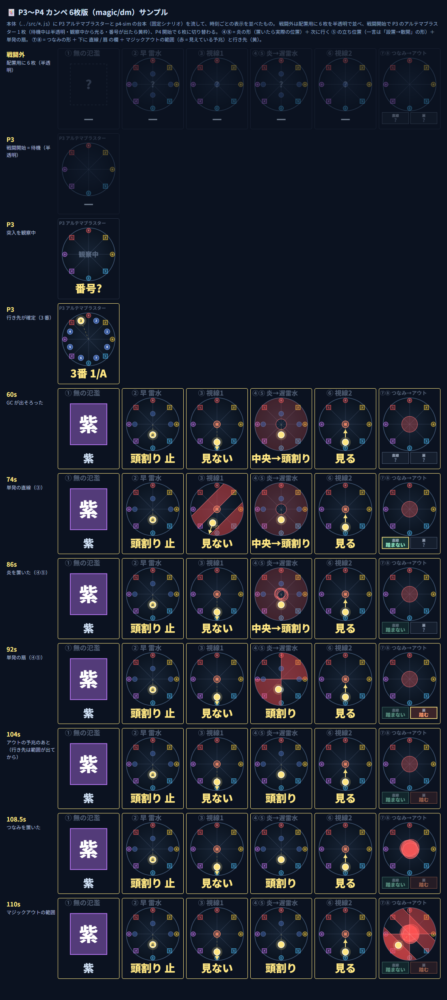

# P3〜P4 カンペ 6枚版 (絶ケフカ・実験)

`magic/dmp4` の改良版の実験。8 枚のうち **④⑤ と ⑦⑧ を 1 枚ずつにまとめて 6 枚**にしたもの
（判定ロジック・範囲の計算は dmp4 と同じ）。さらに **P3 アルテマブラスター**（`magic/ultimablaster` と同じ判定）も入っていて、
フェーズで自動で切り替わる。OverlayPlugin への追加方法・CONFIG は [dmp4 の README](../dmp4/README.md) と同じ。

- **P3 の間**: アルテマブラスターの 1 枚（サイコロ 1〜8 の安置、自分の番号は黄色。一言は「3番 1/A」）。
  待機中は半透明、突入の観察が始まったら光る、自分の番号が出たら黄枠。段数の設定によらず枠の高さいっぱいで出す。
- **戦闘外**（読み込み直後・ワイプ後）は P4 の 6 枚を半透明で並べる。OverlayPlugin で背景を白くして配置するときに
  6 枚ぶんの広さが見える。**戦闘開始**で P3 の 1 枚、**P4 開始（おちょくりソウル）**で 6 枚に切り替わる。
  戦闘中に読み込み直したときも、突入/番号が来れば P3 になる。
- P3 の判定は [src/ultima.js](src/ultima.js)。実ログ 254 回ぶんで `magic/ultimablaster` と結果が一致することを確認済み。

| 枚 | 中身 |
|---|---|
| ① ② ③ ⑥ | dmp4 と同じ（③ には単発の直線と、帯への横スライド） |
| **④⑤ 炎→遅雷水** | 炎の形（置いたら実際の位置で発動まで）＋ 次に行く ⑤ の立ち位置。下の一言は炎が済むまで「設置→散開 止」（ドーナツなら「中央→…」）、済んだら ⑤ だけ。単発の扇もここに重ねて、立ち位置を当たらない扇へ回り込ませる |
| **⑦⑧ つなみ→アウト** | つなみの形（置いたら実際の位置で発動まで）＋ マジックアウトの範囲（赤 = 見えている予兆）と行き先（黄）。下は 直線 / 扇 の欄。図の中央に答えの文字は出さない（行き先を見て動く） |

- 炎 / 水（カオス）もケフカの攻撃（見えている予兆）も**赤**。
- 残り秒はまとめた中で次に来るもの（④⑤: 炎 → ⑤ / ⑦⑧: 直線 → 扇 → つなみ → アウト）。音は締め切りごとに鳴る。
- 大きさの目安: 1 段 680×150 / 2 段（3 × 2）340×290。

## テスト

- `node test/harness.js` … ロジック検証
- `test/samples.html` … 固定シナリオを時刻ごとに流した 6 枚（上の画像）
- `test/replay.html` … 実ログを読み込んで P3（アルテマブラスター）/ P4 を再生
- **シミュレータ: [sim/index.html](sim/index.html)** … P3 アルテマブラスター（0 秒〜）→ P4（30 秒〜）を通しで流す dm 専用版。
  P4 の台本は `p4-sim/timeline.js` をそのまま使い、P3 の台本は [sim/p3.js](sim/p3.js)（実ログの間隔どおり）。
  `#t=秒` を付けるとその時刻から開く。`p4-sim/index.html?v=dm` でも dm を P4 だけ動かせる
